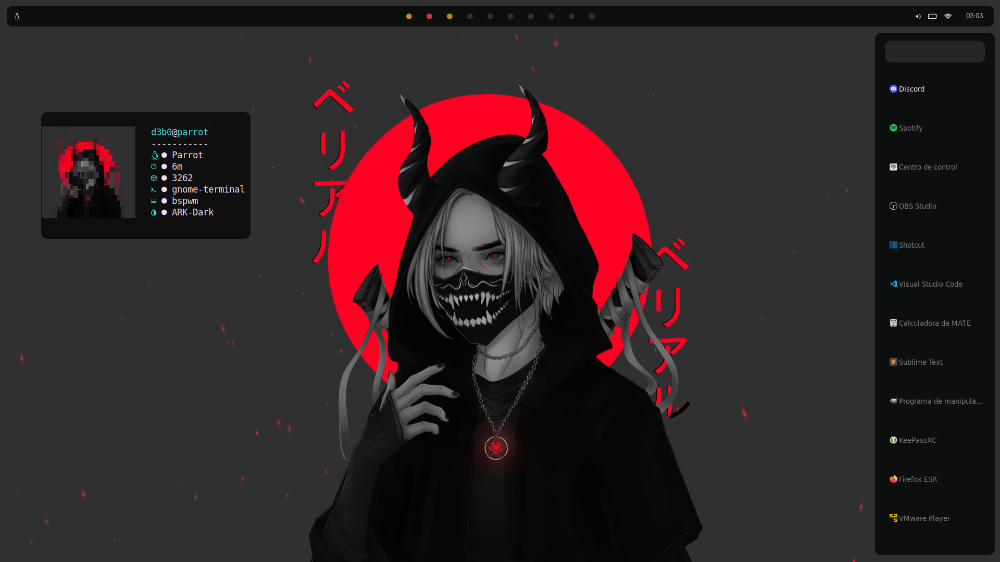
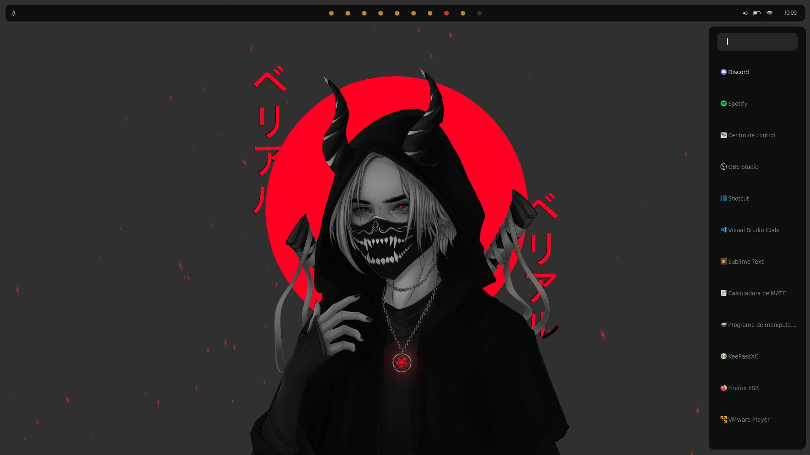
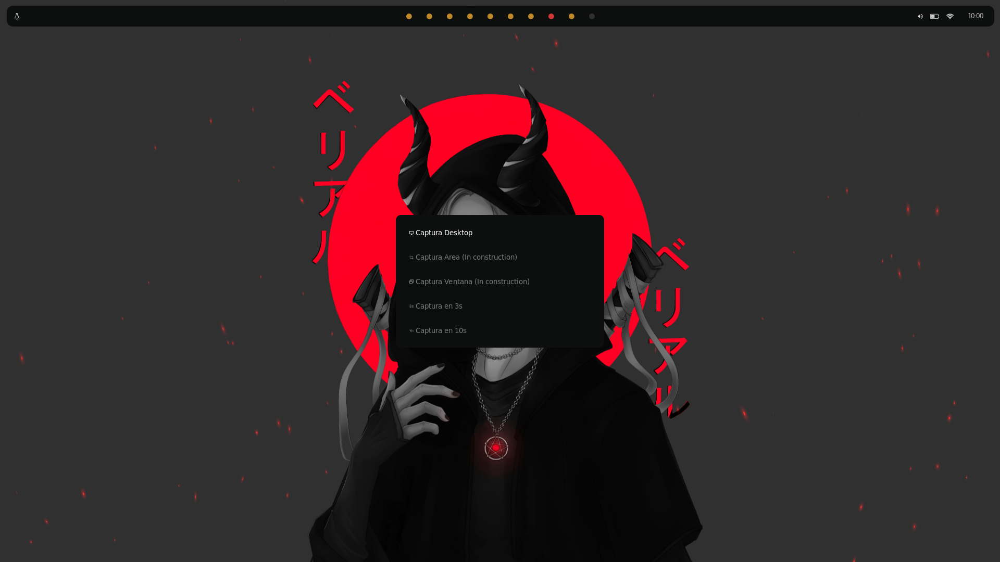
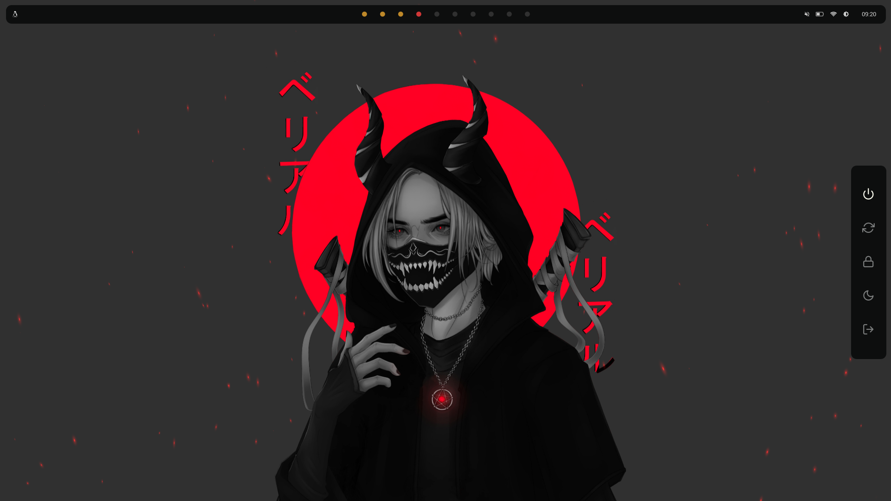

# **Dotfiles**
Minimal bspwm config

Contact-discord: https://discord.gg/rNnCZmXKWw

* Terminal: [gnome terminal](https://github.com/GNOME/gnome-terminal)

* Text Editor: nano
* Window Manager: <a name="bspwm">Bspwm</a>
* Shell: <a name="rofi">zsh</a>
* Application Launcher: <a name="rofi">Rofi</a>
* Panel: <a name="polybar">Polybar</a>
* Shortcuts: <a name="sxhkd">sxhkd</a>

Follow the instructions in `setup.sh`

## **Useful keybindigs to know...**

|  Function | keybindigs |
| --------------- | ------------- |
| gnome-terminal  | ``Super + Return`` |
| Change workspace | ``Super + (1-9)`` |
| rofi launcher  | ``Super + d`` |
| Google-Chrome  | ``Super + Shift + g`` |
| Close Window | ``Super + w``

<a name="sxhkd">More keybindigs</a>

***
## **Rofi**

Launcher

Screenchot

Powermenu

***
## **Polybar**

Based in: https://github.com/adi1090x/polybar-themes (docky style)

**Polybar Modules**

* Date

* Wifi

* Battery

* Workspaces

* HTB vpn Left click: copy ip

* Target Left click: copy ip

* Spotify (Only deploys if it's active)

* And more...

## **sxhkd**

**All keybindigs**

(https://github.com/baskerville/bspwm/blob/master/examples/sxhkdrc + Custom keybindigs)

| Function | keybindigs |
| ----------- | ---------- |
| Terminal | Super + Return |
| Launcher | Super + d |
| Make sxhkd reload its configuration files | Super + Escape |
| Quit/restart bspwm | Super + Alt + r |
| Close and kill | Super + w |
| Alternate between the tiled and monocle layout | Super + m |
| Send the newest marked node to the newest preselected node | Super + y |
| Swap the current node and the biggest node | Super + g |
| Set the window state | Super + {t,shift + t,s,f} |
| Set the node flags | Super + Ctrl + {m,x,y,z} |
| Focus the node in the given direction | super + {_,shift + }{h,j,k,l} |
| Focus the node for the given path jump | super + {p,b,comma,period} |
| Focus the next/previous node in the current desktop | Super + {_,shift + }c |
| Focus the next/previous desktop in the current monitor | Super + bracket{left,right} |
| Focus the last node/desktop | Super + {grave,Tab} |
| Focus the older or newer node in the focus history | Super + {o,i} |
| Focus or send to the given desktop | Super + {_,shift + }{1-9,0} |
| Preselect the direction | Super + Ctrl + Alt + {Left,Down,Up,Right} |
| Preselect the ratio | Super + Ctrl + {1-9} |
| Cancel the preselection for the focused node | Super + Ctrl + Space |
| Cancel the preselection for the focused desktop | Super + Ctrl + Alt + Space |
| Move a floating window | Super + Ctrl + {Left,Down,Up,Right} |
| Custom move/resize | Alt + Super + {Left,Down,Up,Right} |
| **Custom keybindigs** |  |
| Google-Chrome | Super + Shift + g |
| Firefox | Super + Shift + f |
| Files | Super + Shift + o |
| Show IP | Super + Shift + i |
| Rofi Screenshot | Super + Shift + s |
| Rofi Runner | Super + Shift + r |

## **Wallpaper**

